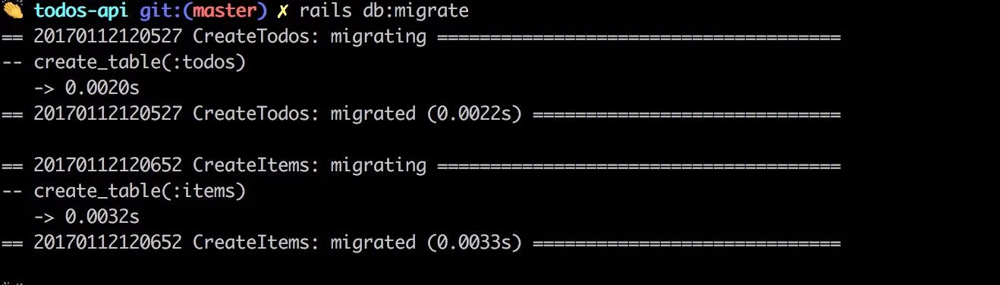
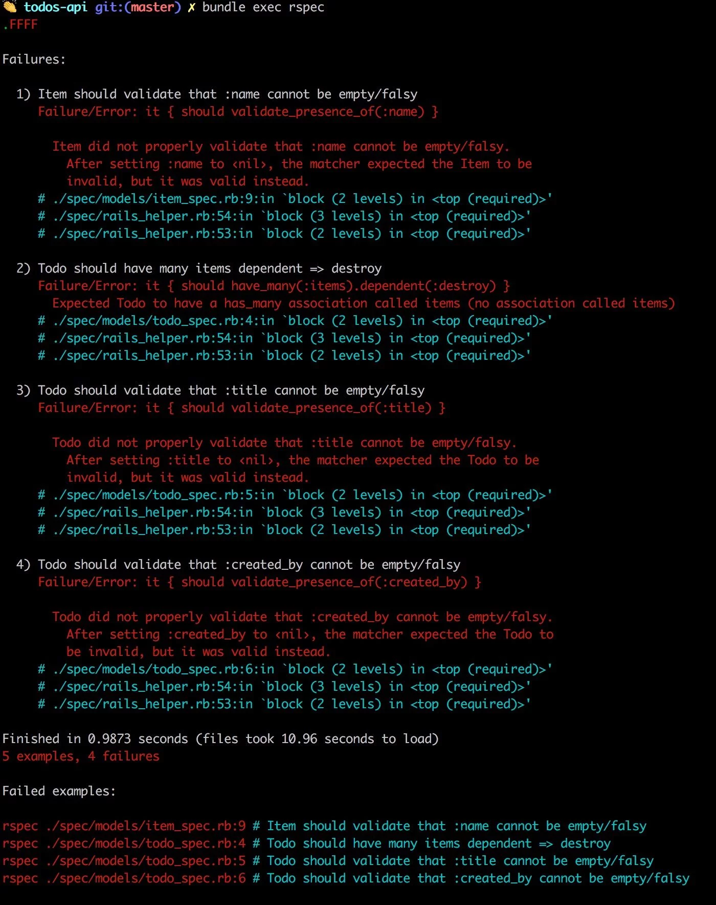
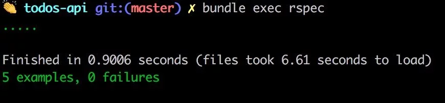
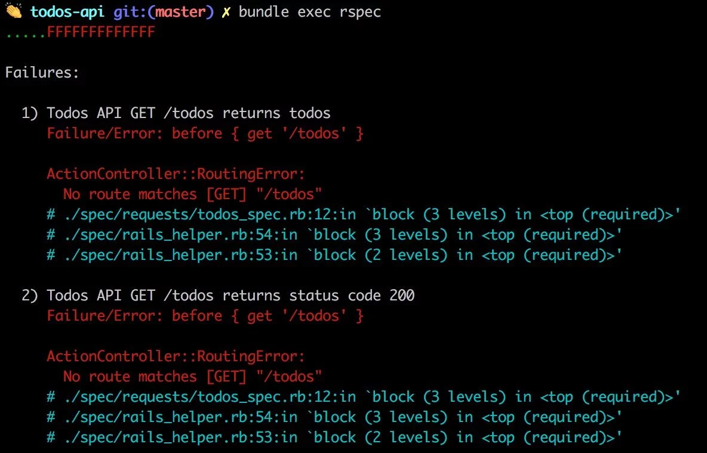
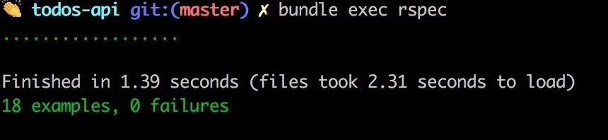
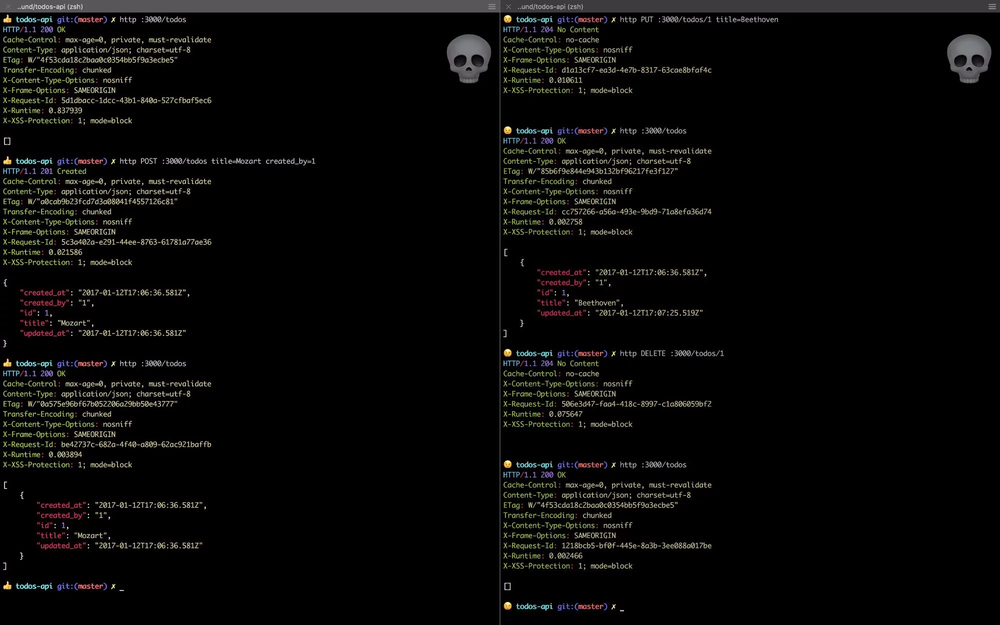
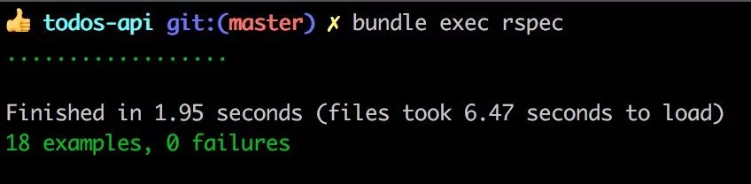
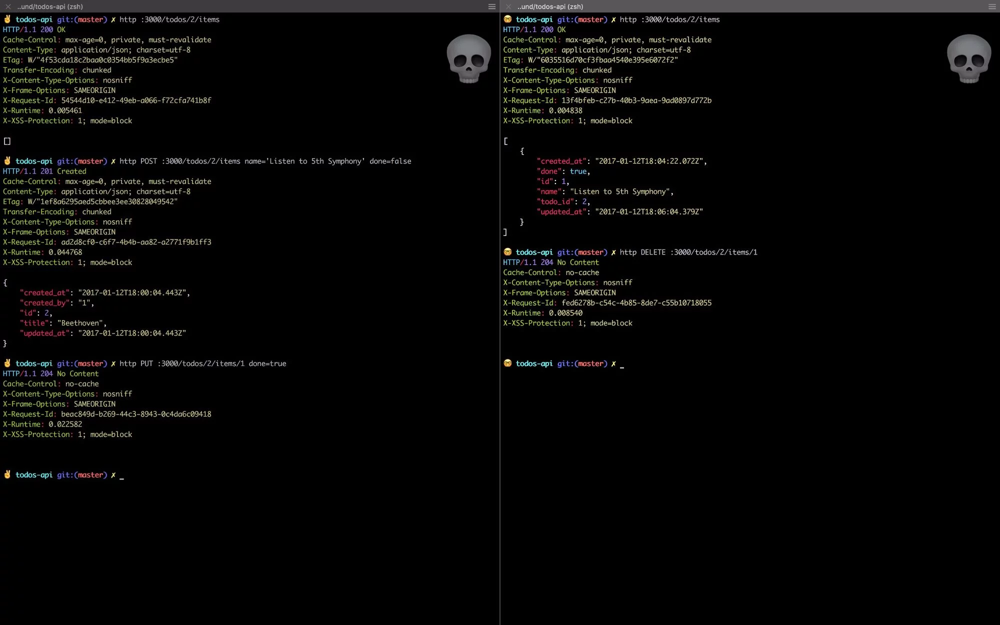

# Build a RESTful JSON API With Rails 5 - Part One

Rails is popularly known for building web applications. Chances are if you're reading this you've built a traditional server-rendered web application with Rails before. If not, I'd highly recommend going through the Getting Started with Rails page to familiarize yourself with the Rails framework before proceeding with this tutorial.

As of version 5, Rails core now supports API only applications! In previous versions, we relied on an external gem: rails-api which has since been merged to core rails.

API only applications are slimmed down compared to traditional Rails web applications. According to Rails 5 release notes, generating an API only application will:

---
## Table of Contents
* [Prerequisites](#prerequisites)
* [Project Setup](#project-setup)
* [Models](#models)
* [Controllers](#controllers)
* [Conclusion](#conclusion)

---
1. Start the application with a limited set of middleware
2. Make the ApplicationController inherit from ActionController::API instead of ActionController::Base
3. Skip generation of view files

This works to generate an API-centric framework excluding functionality that would otherwise be unused and unnecessary.

In this three-part tutorial, we'll build a todo list API where users can manage their to-do lists and todo items.

---
### PREREQUISITES
Before we begin, make sure you have ruby version >=2.2.2 and rails version 5.

````bash
$ ruby -v # ruby 2.3.0p0 (2015-12-25 revision 53290) [x86_64-darwin16]
$ rails -v # Rails 5.0.1
````

If your ruby version is not up to date, you can update it with a ruby version manager like rvm or rbenv.

````bash
# when using rbenv
$ rbenv install 2.3.1
# set 2.3.1 as the global version
$ rbenv global 2.3.1
# when using rvm
$ rvm install 2.3.1
# set 2.3.1 as the global version
$ rvm use 2.3.1
If your rails version is not up to date, update to the latest version by running:

$ gem update rails
````

All good? Let's get started!

---
#### API Endpoints

Our API will expose the following RESTful endpoints.


Endpoint	              | Functionality
----------------------- | ------------------------
POST /signup            | Signup
POST /auth/login        | Login
GET /auth/logout        | Logout
GET /todos              | List all todos
POST /todos             | Create a new todo
GET /todos/:id          | Get a todo
PUT /todos/:id          | Update a todo
DELETE /todos/:id       | Delete a todo and its items
GET /todos/:id/items    | Get a todo item
PUT /todos/:id/items    | Update a todo item
DELETE /todos/:id/items | Delete a todo item

Part One will Cover:

- Project setup
- Todos API
- TodoItems API

---
### PROJECT SETUP

Generate a new project todos-api by running:

````bash
$ rails new todos-api --api -T
````

Note that we're using the --api argument to tell Rails that we want an API application and -T to exclude Minitest the default testing framework. Don't freak out, we're going to write tests. We'll be using RSpec instead to test our API. I find RSpec to be more expressive and easier to start with as compared to Minitest.

---
#### Dependencies

Let's take a moment to review the gems that we'll be using.

- rspec-rails - Testing framework.
- factory_bot_rails - A fixtures replacement with a more straightforward syntax. You'll see.
- shoulda_matchers - Provides RSpec with additional matchers.
- database_cleaner - You guessed it! It literally cleans our test database to ensure a clean state in each test suite.
- faker - A library for generating fake data. We'll use this to generate test data.

All good? Great! Let's set them up. In your Gemfile:

Add rspec-rails to both the :development and :test groups.

````ruby
# Gemfile
group :development, :test do
  gem 'rspec-rails', '~> 3.5'
end
````

This is a handy shorthand to include a gem in multiple environments.

Add factory_bot_rails, shoulda_matchers, faker and database_cleaner to the :test group.

````ruby
# Gemfile
group :test do
  gem 'factory_bot_rails', '~> 4.0'
  gem 'shoulda-matchers', '~> 3.1'
  gem 'faker'
  gem 'database_cleaner'
end
````

Install the gems by running:

````bash
$ bundle install
````

Initialize the spec directory (where our tests will reside).

````bash
$ rails generate rspec:install
````

This adds the following files which are used for configuration:

- .rspec
- spec/spec_helper.rb
- spec/rails_helper.rb

Create a factories directory (factory bot uses this as the default directory). This is where we'll define the model factories.

````bash
$ mkdir spec/factories
````

---
#### Configuration
In spec/rails_helper.rb

````ruby
# require database cleaner at the top level
require 'database_cleaner'

# [...]
# configure shoulda matchers to use rspec as the test framework and full matcher libraries for rails
Shoulda::Matchers.configure do |config|
  config.integrate do |with|
    with.test_framework :rspec
    with.library :rails
  end
end

# [...]
RSpec.configuration do |config|
  # [...]
  # add `FactoryBot` methods
  config.include FactoryBot::Syntax::Methods

  # start by truncating all the tables but then use the faster transaction strategy the rest of the time.
  config.before(:suite) do
    DatabaseCleaner.clean_with(:truncation)
    DatabaseCleaner.strategy = :transaction
  end

  # start the transaction strategy as examples are run
  config.around(:each) do |example|
    DatabaseCleaner.cleaning do
      example.run
    end
  end
  # [...]
end
````

Phew! That was a rather long. Good thing is, it's a smooth ride from here on out.

---
### MODELS

Let's start by generating the Todo model

````bash
$ rails g model Todo title:string created_by:string
````

Notice that we've included the model attributes in the model generation command. This way we don't have to edit the migration file. The generator invokes active record and rspec to generate the migration, model, and spec respectively.

````ruby
# db/migrate/[timestamp]_create_todos.rb
class CreateTodos < ActiveRecord::Migration[5.0]
  def change
    create_table :todos do |t|
      t.string :title
      t.string :created_by

      t.timestamps
    end
  end
end
````

And now the Item model

````bash
$ rails g model Item name:string done:boolean todo:references
````

By adding todo:references we're telling the generator to set up an association with the Todo model. This will do the following:

Add a foreign key column todo_id to the items table
Setup a belongs_to association in the Item model

````ruby
# db/migrate/[timestamp]_create_items.rb
class CreateItems < ActiveRecord::Migration[5.0]
  def change
    create_table :items do |t|
      t.string :name
      t.boolean :done
      t.references :todo, foreign_key: true

      t.timestamps
    end
  end
end
````

Looks good? Let's run the migrations.

````bash
$ rails db:migrate
````



We're Test Driven, let's write the model specs first.

````ruby
# spec/models/todo_spec.rb
require 'rails_helper'

# Test suite for the Todo model
RSpec.describe Todo, type: :model do
  # Association test
  # ensure Todo model has a 1:m relationship with the Item model
  it { should have_many(:items).dependent(:destroy) }
  # Validation tests
  # ensure columns title and created_by are present before saving
  it { should validate_presence_of(:title) }
  it { should validate_presence_of(:created_by) }
end
````

RSpec has a very expressive DSL (Domain Specific Language). You can almost read the tests like a paragraph. Remember our shoulda matchers gem? It provides RSpec with the nifty association and validation matchers above.

````ruby
# spec/models/item_spec.rb
require 'rails_helper'

# Test suite for the Item model
RSpec.describe Item, type: :model do
  # Association test
  # ensure an item record belongs to a single todo record
  it { should belong_to(:todo) }
  # Validation test
  # ensure column name is present before saving
  it { should validate_presence_of(:name) }
end
````

Let's execute the specs by running:

````bash
$ bundle exec rspec
````



And to no surprise, we have only one test passing and four failures. Let's go ahead and fix the failures.

````ruby
# app/models/todo.rb
class Todo < ApplicationRecord
  # model association
  has_many :items, dependent: :destroy

  # validations
  validates_presence_of :title, :created_by
end

# app/models/item.rb
class Item < ApplicationRecord
  # model association
  belongs_to :todo

  # validation
  validates_presence_of :name
end
````

At this point run the tests again and...



voila! All green.

---
### CONTROLLERS

Now that our models are all setup, let's generate the controllers.

````bash
$ rails g controller Todos
$ rails g controller Items
````

You guessed it! Tests first... with a slight twist. Generating controllers by default generates controller specs. However, we won't be writing any controller specs. We're going to write request specs instead.

Request specs are designed to drive behavior through the full stack, including routing. This means they can hit the applications' HTTP endpoints as opposed to controller specs which call methods directly. Since we're building an API application, this is exactly the kind of behavior we want from our tests.

According to RSpec, the official recommendation of the Rails team and the RSpec core team is to write request specs instead.

Add a requests folder to the spec directory with the corresponding spec files.

````bash
$ mkdir spec/requests && touch spec/requests/{todos_spec.rb,items_spec.rb}
````

Before we define the request specs, Let's add the model factories which will provide the test data.

Add the factory files:

````bash
$ touch spec/factories/{todos.rb,items.rb}
````

Define the factories.

````ruby
# spec/factories/todos.rb
FactoryBot.define do
  factory :todo do
    title { Faker::Lorem.word }
    created_by { Faker::Number.number(10) }
  end
end
````

By wrapping faker methods in a block, we ensure that faker generates dynamic data every time the factory is invoked. This way, we always have unique data.

````ruby
# spec/factories/items.rb
FactoryBot.define do
  factory :item do
    name { Faker::StarWars.character }
    done false
    todo_id nil
  end
end
````

#### Todo API

````ruby
# spec/requests/todos_spec.rb
require 'rails_helper'

RSpec.describe 'Todos API', type: :request do
  # initialize test data
  let!(:todos) { create_list(:todo, 10) }
  let(:todo_id) { todos.first.id }

  # Test suite for GET /todos
  describe 'GET /todos' do
    # make HTTP get request before each example
    before { get '/todos' }

    it 'returns todos' do
      # Note `json` is a custom helper to parse JSON responses
      expect(json).not_to be_empty
      expect(json.size).to eq(10)
    end

    it 'returns status code 200' do
      expect(response).to have_http_status(200)
    end
  end

  # Test suite for GET /todos/:id
  describe 'GET /todos/:id' do
    before { get "/todos/#{todo_id}" }

    context 'when the record exists' do
      it 'returns the todo' do
        expect(json).not_to be_empty
        expect(json['id']).to eq(todo_id)
      end

      it 'returns status code 200' do
        expect(response).to have_http_status(200)
      end
    end

    context 'when the record does not exist' do
      let(:todo_id) { 100 }

      it 'returns status code 404' do
        expect(response).to have_http_status(404)
      end

      it 'returns a not found message' do
        expect(response.body).to match(/Couldn't find Todo/)
      end
    end
  end

  # Test suite for POST /todos
  describe 'POST /todos' do
    # valid payload
    let(:valid_attributes) { { title: 'Learn Elm', created_by: '1' } }

    context 'when the request is valid' do
      before { post '/todos', params: valid_attributes }

      it 'creates a todo' do
        expect(json['title']).to eq('Learn Elm')
      end

      it 'returns status code 201' do
        expect(response).to have_http_status(201)
      end
    end

    context 'when the request is invalid' do
      before { post '/todos', params: { title: 'Foobar' } }

      it 'returns status code 422' do
        expect(response).to have_http_status(422)
      end

      it 'returns a validation failure message' do
        expect(response.body)
          .to match(/Validation failed: Created by can't be blank/)
      end
    end
  end

  # Test suite for PUT /todos/:id
  describe 'PUT /todos/:id' do
    let(:valid_attributes) { { title: 'Shopping' } }

    context 'when the record exists' do
      before { put "/todos/#{todo_id}", params: valid_attributes }

      it 'updates the record' do
        expect(response.body).to be_empty
      end

      it 'returns status code 204' do
        expect(response).to have_http_status(204)
      end
    end
  end

  # Test suite for DELETE /todos/:id
  describe 'DELETE /todos/:id' do
    before { delete "/todos/#{todo_id}" }

    it 'returns status code 204' do
      expect(response).to have_http_status(204)
    end
  end
end
````

We start by populating the database with a list of 10 todo records (thanks to factory bot). We also have a custom helper method json which parses the JSON response to a Ruby Hash which is easier to work with in our tests. Let's define it in spec/support/request_spec_helper.

Add the directory and file:

````bash
$ mkdir spec/support && touch spec/support/request_spec_helper.rb
````

````ruby
# spec/support/request_spec_helper
module RequestSpecHelper
  # Parse JSON response to ruby hash
  def json
    JSON.parse(response.body)
  end
end
````

The support directory is not autoloaded by default. To enable this, open the rails helper and comment out the support directory auto-loading and then include it as shared module for all request specs in the RSpec configuration block.

````ruby
# spec/rails_helper.rb
# [...]
Dir[Rails.root.join('spec/support/**/*.rb')].each { |f| require f }
# [...]
RSpec.configuration do |config|
  # [...]
  config.include RequestSpecHelper, type: :request
  # [...]
end
````

Run the tests.



We get failing routing errors. This is because we haven't defined the routes yet. Go ahead and define them in config/routes.rb.

````ruby
# config/routes.rb
Rails.application.routes.draw do
  resources :todos do
    resources :items
  end
end
````

In our route definition, we're creating todo resource with a nested items resource. This enforces the 1:m (one to many) associations at the routing level. To view the routes, you can run:

````bash
$ rails routes
````

When we run the tests we see that the routing error is gone. As expected we have controller failures. Let's go ahead and define the controller methods.

````ruby
# app/controllers/todos_controller.rb
class TodosController < ApplicationController
  before_action :set_todo, only: [:show, :update, :destroy]

  # GET /todos
  def index
    @todos = Todo.all
    json_response(@todos)
  end

  # POST /todos
  def create
    @todo = Todo.create!(todo_params)
    json_response(@todo, :created)
  end

  # GET /todos/:id
  def show
    json_response(@todo)
  end

  # PUT /todos/:id
  def update
    @todo.update(todo_params)
    head :no_content
  end

  # DELETE /todos/:id
  def destroy
    @todo.destroy
    head :no_content
  end

  private

  def todo_params
    # whitelist params
    params.permit(:title, :created_by)
  end

  def set_todo
    @todo = Todo.find(params[:id])
  end
end
````

More helpers. Yay! This time we have:

json_response which does... yes, responds with JSON and an HTTP status code (200 by default). We can define this method in concerns folder.

````ruby
# app/controllers/concerns/response.rb
module Response
  def json_response(object, status = :ok)
    render json: object, status: status
  end
end
````

set_todo - callback method to find a todo by id. In the case where the record does not exist, ActiveRecord will throw an exception ActiveRecord::RecordNotFound. We'll rescue from this exception and return a 404 message.

````ruby
# app/controllers/concerns/exception_handler.rb
module ExceptionHandler
  # provides the more graceful `included` method
  extend ActiveSupport::Concern

  included do
    rescue_from ActiveRecord::RecordNotFound do |e|
      json_response({ message: e.message }, :not_found)
    end

    rescue_from ActiveRecord::RecordInvalid do |e|
      json_response({ message: e.message }, :unprocessable_entity)
    end
  end
end
````

In our create method in the TodosController, note that we're using create! instead of create. This way, the model will raise an exception ActiveRecord::RecordInvalid. This way, we can avoid deep nested if statements in the controller. Thus, we rescue from this exception in the ExceptionHandler module.

However, our controller classes don't know about these helpers yet. Let's fix that by including these modules in the application controller.

````ruby
# app/controllers/application_controller.rb
class ApplicationController < ActionController::API
  include Response
  include ExceptionHandler
end
````

Run the tests and everything's all green!



Let's fire up the server for some good old manual testing.

````bash
$ rails s
````

Now let's go ahead and make requests to the API. I'll be using httpie as my HTTP client.

````bash
# GET /todos
$ http :3000/todos
# POST /todos
$ http POST :3000/todos title=Mozart created_by=1
# PUT /todos/:id
$ http PUT :3000/todos/1 title=Beethoven
# DELETE /todos/:id
$ http DELETE :3000/todos/1
````

You should see similar output.



#### TodoItems API

````ruby
# spec/requests/items_spec.rb
require 'rails_helper'

RSpec.describe 'Items API' do
  # Initialize the test data
  let!(:todo) { create(:todo) }
  let!(:items) { create_list(:item, 20, todo_id: todo.id) }
  let(:todo_id) { todo.id }
  let(:id) { items.first.id }

  # Test suite for GET /todos/:todo_id/items
  describe 'GET /todos/:todo_id/items' do
    before { get "/todos/#{todo_id}/items" }

    context 'when todo exists' do
      it 'returns status code 200' do
        expect(response).to have_http_status(200)
      end

      it 'returns all todo items' do
        expect(json.size).to eq(20)
      end
    end

    context 'when todo does not exist' do
      let(:todo_id) { 0 }

      it 'returns status code 404' do
        expect(response).to have_http_status(404)
      end

      it 'returns a not found message' do
        expect(response.body).to match(/Couldn't find Todo/)
      end
    end
  end

  # Test suite for GET /todos/:todo_id/items/:id
  describe 'GET /todos/:todo_id/items/:id' do
    before { get "/todos/#{todo_id}/items/#{id}" }

    context 'when todo item exists' do
      it 'returns status code 200' do
        expect(response).to have_http_status(200)
      end

      it 'returns the item' do
        expect(json['id']).to eq(id)
      end
    end

    context 'when todo item does not exist' do
      let(:id) { 0 }

      it 'returns status code 404' do
        expect(response).to have_http_status(404)
      end

      it 'returns a not found message' do
        expect(response.body).to match(/Couldn't find Item/)
      end
    end
  end

  # Test suite for PUT /todos/:todo_id/items
  describe 'POST /todos/:todo_id/items' do
    let(:valid_attributes) { { name: 'Visit Narnia', done: false } }

    context 'when request attributes are valid' do
      before { post "/todos/#{todo_id}/items", params: valid_attributes }

      it 'returns status code 201' do
        expect(response).to have_http_status(201)
      end
    end

    context 'when an invalid request' do
      before { post "/todos/#{todo_id}/items", params: {} }

      it 'returns status code 422' do
        expect(response).to have_http_status(422)
      end

      it 'returns a failure message' do
        expect(response.body).to match(/Validation failed: Name can't be blank/)
      end
    end
  end

  # Test suite for PUT /todos/:todo_id/items/:id
  describe 'PUT /todos/:todo_id/items/:id' do
    let(:valid_attributes) { { name: 'Mozart' } }

    before { put "/todos/#{todo_id}/items/#{id}", params: valid_attributes }

    context 'when item exists' do
      it 'returns status code 204' do
        expect(response).to have_http_status(204)
      end

      it 'updates the item' do
        updated_item = Item.find(id)
        expect(updated_item.name).to match(/Mozart/)
      end
    end

    context 'when the item does not exist' do
      let(:id) { 0 }

      it 'returns status code 404' do
        expect(response).to have_http_status(404)
      end

      it 'returns a not found message' do
        expect(response.body).to match(/Couldn't find Item/)
      end
    end
  end

  # Test suite for DELETE /todos/:id
  describe 'DELETE /todos/:id' do
    before { delete "/todos/#{todo_id}/items/#{id}" }

    it 'returns status code 204' do
      expect(response).to have_http_status(204)
    end
  end
end
````

As expected, running the tests at this point should output failing todo item tests. Let's define the todo items controller.

````ruby
# app/controllers/items_controller.rb
class ItemsController < ApplicationController
  before_action :set_todo
  before_action :set_todo_item, only: [:show, :update, :destroy]

  # GET /todos/:todo_id/items
  def index
    json_response(@todo.items)
  end

  # GET /todos/:todo_id/items/:id
  def show
    json_response(@item)
  end

  # POST /todos/:todo_id/items
  def create
    @todo.items.create!(item_params)
    json_response(@todo, :created)
  end

  # PUT /todos/:todo_id/items/:id
  def update
    @item.update(item_params)
    head :no_content
  end

  # DELETE /todos/:todo_id/items/:id
  def destroy
    @item.destroy
    head :no_content
  end

  private

  def item_params
    params.permit(:name, :done)
  end

  def set_todo
    @todo = Todo.find(params[:todo_id])
  end

  def set_todo_item
    @item = @todo.items.find_by!(id: params[:id]) if @todo
  end
end
````

Run the tests.



Run some manual tests for the todo items API:

````bash
# GET /todos/:todo_id/items
$ http :3000/todos/2/items
# POST /todos/:todo_id/items
$ http POST :3000/todos/2/items name='Listen to 5th Symphony' done=false
# PUT /todos/:todo_id/items/:id
$ http PUT :3000/todos/2/items/1 done=true
# DELETE /todos/:todo_id/items/1
$ http DELETE :3000/todos/2/items/1
````



---
### CONCLUSION

That's it for part one! At this point you should have learned how to:

- Generate an API application with Rails 5
- Setup RSpec testing framework with Factory Bot, Database Cleaner, Shoulda Matchers and Faker.
- Build models and controllers with TDD (Test Driven Development).
- Make HTTP requests to an API with httpie.
- In the next part, we'll cover authentication with JWT, pagination, and API versioning. Hope to see you there. Cheers!

#### Credits

[Austin Kabiru](https://scotch.io/tutorials/build-a-restful-json-api-with-rails-5-part-one)
