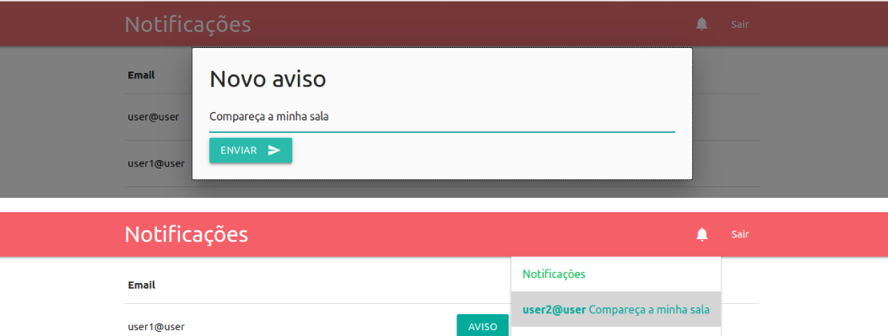

# Real-time Notifications com rails 5.1



Utilizar chamadas Ajax para enviar requisições a todo momento ao nosso servidor para verificar a existência de novas notificações, não é uma boa prática. Isto consome muito recurso e dependendo do fluxo do sistema pode até derruba-lo. Para isto contamos com algo muito massa chamado Websocket.

De forma resumida, utilizaremos esta tecnologia para que quando uma nova notificação seja criada, nossa aplicação a envie ao seu destinatário.

Sim, é isso mesmo que você leu, o destinatário não precisa fazer uma requisição para receber novas notificações, enviaremos para ele em tempo real !!!

Para utilização de Websockets, o Rails facilita nossa vida com uma biblioteca interna chamada Action Cable.
Entenderemos melhor sobre isso após seguir os passos desse tutorial.

Bom, chega de conversa e vamos codar 😆

Para criar nossa aplicação utilizando a versão 5.1.6 do rails utilize

````bash
$ rails _5.1.6_ new notifications
````

Criando o banco de dados

````bash
$ rails db:create
````

Utilizaremos jQuery, Materialize e o Devise. Para começar adicione ao Gemfile do projeto

````ruby
gem 'devise'
gem 'jquery-rails', '~> 4.3', '>= 4.3.1'
gem 'materialize-sass', '~> 1.0.0.beta'
````

Agora instale as gems

````bash
$ bundle install
````

Para utilizarmos o materialize precisamos executar os comandos

````bash
$ rm app/assets/stylesheets/application.css
$ touch app/assets/stylesheets/application.scss
````

Agora que criamos o arquivo application.scss vamos importar o materialize e o material icons.

````ruby
# app/assets/stylesheets/application.scss
@import "materialize";
@import "https://fonts.googleapis.com/icon?family=Material+Icons";
````

e carregar os arquivos js que iremos precisar

````js
# app/assets/javascripts/application.js
//= require materialize
//= require jquery
//= require jquery_ujs
````

Feito isso podemos criar a navbar da nossa aplicação

````bash
mkdir app/views/partials
touch app/views/partials/_navbar.html.erb
````

e adicionar o seguinte código a ela

````html
<!-- Dropdown Structure -->
<ul id="dropdown1" class="dropdown-content">
  <li><a href="#!">Notificações</a></li>
  <li class="divider"></li>
  <div data-behavior="notices">
  </div>
</ul>
<nav>
  <div class="nav-wrapper">
    <div class="container">
      <a href="#" class="brand-logo">Notificações</a>
      <ul id="nav-mobile" class="right hide-on-med-and-down">
        <li><a class="dropdown-trigger" href="#!" data-target="dropdown1"><i class="material-icons">notifications</i></a></li>
        <li>
          <%= link_to('Sair', destroy_user_session_path, method: :delete) %>
        </li>
      </ul>
    </div>
  </div>
</nav>
````

Agora, criaremos o controller Home contendo a action index

````bash
$ rails g controller Home index
````

e os definiremos como root de sua aplicação

````ruby
# config/routes.rb
Rails.application.routes.draw do
  root to: 'home#index'
end
````

Para que nosso dropdown das notificações funcione precisamos inicia-lo utilizando algumas opções conforme o código abaixo.

````js
# app/assets/javascripts/home.coffee
document.addEventListener 'DOMContentLoaded', ->
  M.AutoInit()
  elem = document.querySelector('.dropdown-trigger')
  instance = M.Dropdown.init(elem, {
    closeOnClick: false,
    coverTrigger: false,
    constrainWidth: false,
    alignment: 'right',
  })
  return
````

Por fim adicione o seguinte código no layout application

````ruby
# app/views/layouts/application.html.erb
<!DOCTYPE html>
<html>
  <head>
    <title>Notifications</title>
    <%= csrf_meta_tags %>
<%= stylesheet_link_tag    'application', media: 'all', 'data-    turbolinks-track': 'reload' %>
    <%= javascript_include_tag 'application', 'data-turbolinks-track': 'reload' %>
  </head>
<body>
    <%= render partial: "partials/navbar"%>
    <div class="container">
      <p class="notice"><%= notice %></p>
      <p class="alert"><%= alert %></p>
      <%= yield %>
    </div>
  </body>
</html>
````

Agora podemos partir para as configurações do devise

````bash
$ rails generate devise:install
$ rails generate devise user
$ rails g devise:views
$ rails db:migrate
````

Adicione o seguinte filtro ao Application Controller

````ruby
# app/controllers/application_controller.rb
before_action :authenticate_user!
````

Pronto agora executando rails s e depois acessando localhost:3000 você poderá se cadastrar e ver que nossa pagina index ainda não tem muita coisa. Nossas notificações também estão vazias.
Utilize o generate para criar um model chamado notice. Ele será responsável pelos avisos, ou se preferir, nossas notificações.

````bash
$ rails g model notice
````

Nosso model Notice terá um campo do tipo string chamado body onde será salvo a mensagem do aviso, a referência de users chamada sender a qual se destina ao usuário que enviou a mensagem e outra referência de users chamada recipient, ou seja, o destinatário desta mensagem.
Para isto abra a ultima migration em db/migrate/ e adicione o seguinte código ao arquivo.

````ruby
class CreateNotices < ActiveRecord::Migration[5.1]
  def change
    create_table :notices do |t|
      t.string :body
      t.references :sender
      t.references :recipient
      t.timestamps
    end
    add_foreign_key :notices, :users, column: :sender_id, primary_key: :id
    add_foreign_key :notices, :users, column: :recipient_id, primary_key: :id
  end
end
````

agora execute

````bash
$ rails db:migrate
````

Para o relacionamento entre users e notice faça

````ruby
# app/models/notice.rb
class Notice < ApplicationRecord
  belongs_to :sender, class_name: 'User'
  belongs_to :recipient, class_name: 'User'
end
````

e

````ruby
# app/models/user.rb
class User < ApplicationRecord
  devise :database_authenticatable, :registerable,
         :recoverable, :rememberable, :trackable, :validatable
  has_many :notices
end
````

Listaremos todos os usuários em uma tabela seguido de um botão com o texto aviso. Quando clicarmos neste botão abriremos uma modal com um formulário para envio de um novo aviso.
Para começar, substitua o controller Home pelo código abaixo.

````ruby
# app/controllers/home_controller.rb
class HomeController < ApplicationController
  def index
    @users = User.where.not(id: current_user.id)
  end
end
````

depois crie o controller notices

````bash
$ rails g controller Notices
````

e adicione o seguinte código

````ruby
class NoticesController < ApplicationController
  def create
    @notice = Notice.new(notice_params)
    respond_to do |format|
      if @notice.save
        format.html { redirect_to root_path }
      end
    end
  end

  private
  def notice_params
    params.require(:notice).permit(:body, :sender_id, :recipient_id)
  end
end
````

Agora adicione a rota para criar um novo aviso, que apontará para nosso controller notices e nossa action create;

````ruby
# config/routes.rb
post '/create-notice', to: 'notices#create'
````

Bom, tendo a rota e a action para criar um novo aviso, vamos adicionar essa função em nossa view. Listando todos usuários com a opção de novo Aviso:

````ruby
# app/views/home/index.html.erb
<table>
  <thead>
    <tr>
        <th>Email</th>
        <th></th>
    </tr>
  </thead>
<tbody>
    <% @users.each do |user| %>
      <tr>
        <td><%= user.email %></td>
        <td><!-- Modal Trigger -->
          <a class="waves-effect waves-light btn modal-trigger" href="#modal1" onclick="modalRecipient(<%= user.id %>)" >Aviso</a>
        </td>
      </tr>
    <% end %>
  </tbody>
</table>
<!-- Modal Structure -->
<div id="modal1" class="modal">
  <div class="modal-content">
    <h4>Novo aviso</h4>
    <%= form_with scope: Notice.new, url: create_notice_path, local: true do |f| %>
      Mensagem: <%= f.text_field :body %>
       <%= f.text_field :recipient_id, id:'recipient', hidden:true%>
       <%= f.text_field :sender_id, hidden:true, value:current_user.id %>
      <button class="btn waves-effect waves-light" type="submit" name="action">Enviar
        <i class="material-icons right">send</i>
      </button>
    <% end %>
  </div>
</div>
<script>
  function modalRecipient(recipientId) {
    $('#recipient').val(recipientId);
  };
</script>
````

Agora podemos enviar novos avisos para qualquer usuários do nosso sistema.

Bom, de que adianta criar avisos se ainda não podemos vê-los?
Partiremos da ideia que nossas notificações serão carregadas apenas a primeira vez que clicarmos no dropdown com ícone de notificação. Após isto, o Action Cable se encarregara de incluir novas notificações.

Para adicionar as notificações a lista do dropdown, siga os seguintes passos:
Adicione esta ao nosso controller Notices

````ruby
# app/controller/notices_controller.rb
  def notifications
    @notices = Notice.where(recipient: current_user)
    respond_to do |format|
      format.js
    end
  end
````

como estamos utilizando como resposta o formato js, crie o arquivo notifications.js.erb em views/notices/ e depois copie e cole o seguinte snippet

````js
var notification = '';
<% if @notices.length < 1 %>
  notification = '<li><a href="#!">Nenhuma notificação.</a></li>';
<% else %>
  <% @notices.reverse_each do |notice| %>
    notification += "<li><a href=''#!'><b><%= notice.sender.email %></b> <%= notice.body %></a></li>";
  <% end %>
<% end %>
$('[data-behavior~=notices]').prepend(notification);
````

Para acessar esse método que retorna nossas notificações precisaremos adicionar um caminho a nossas rotas

````ruby
# config/routes.rb
get '/notifications', to: 'notices#notifications'
````

Pronto, agora faremos a chamada ajax para essa rota e teremos todos os nossos avisos até o momento. Lembre-se, isso só ocorre a primeira vez que abrirmos nosso dropdown.

Altere o código do arquivo abaixo pelo seguinte snippet

````js
# app/assets/javascripts/home.coffee
notificationsClick = 0
document.addEventListener 'DOMContentLoaded', ->
  M.AutoInit()
  elem = document.querySelector('.dropdown-trigger')
  instance = M.Dropdown.init(elem, {
    closeOnClick: false,
    coverTrigger: false,
    constrainWidth: false,
    alignment: 'right',
    onOpenEnd: ->
      if notificationsClick == 0
        $.ajax(url: '/notifications').done ->
          elem = document.querySelector('.dropdown-trigger')
          instance = M.Dropdown.getInstance(elem)
          instance.recalculateDimensions()
          notificationsClick = 1
          return
    ,
  })
  return
````

Nele iniciamos uma variável chama notificationsClick e adicionamos a opção onOpenEnd ao nosso dropdown. Quando o dropdown termina de ser aberto, fazemos nossa chamada ajax que retorna nossas notificações. Depois criamos uma instancia do nosso dropdown e recalculamos suas dimensões, e por fim adicionamos o valor 1 a nossa variável notificationsClick para não executar essa tarefa novamente.

Agora você pode iniciar o servidor e fazer o teste se visualizará os avisos que lhe foram destinados.

Chegou a tão aguardada hora, Action Cable times!!!
Inicialmente execute

````bash
rails g channel Notifications
````

Quando o usuário entrar em nossa aplicação, irá ingressar em um channel. Cada usuário terá um channel único para que nossa aplicação consiga se comunicar com eles. Para criar nossos channels de forma dinâmica faça

````ruby
# app/channels/notifications_channel.rb
class NotificationsChannel < ApplicationCable::Channel
  def subscribed
    stream_from "notifications:#{current_user.id}"
  end
def unsubscribed
    stop_all_streams
  end
end
````

O nosso currente_user ainda não foi definido. Vamos fazer isso no arquivo connection.rb. Nele também iremos recusar conexões de usuários não autenticados.

````ruby
# app/channels/application_cable/connection.rb
module ApplicationCable
  class Connection < ActionCable::Connection::Base
    identified_by :current_user

    def connect
      self.current_user = find_verfied_user
    end

    protected

    def find_verfied_user
      if (current_user = env['warden'].user)
        current_user
      else
        reject_unauthorized_connection
      end
    end
  end
end
````

Caso o usuário esteja conectado o current_user da nossa conexão será igual a env[‘warden’].user. Não se espante, este é o lugar que o devise guarda o user da sessão atual. Se não estiver autenticado, rejeitamos a conexão.

Agora utilizaremos Jobs e eu te explicarei o porque.

Quando uma nova notificação é criada, iremos chamar um job. De forma sucinta, ele irá ser executado no servidor, e o usuário não precisa ficar aguardando o seu termino. Podemos liberar o usuário para continuar navegando, e enquanto isso nosso sistema executa todos os jobs em fila.

Em nosso Job faremos a transmissão da notificação ao seu destinatário!

Para começar execute

````bash
rails g job NotificationRelay
````

Nosso job deve ser chamado após a criação de um novo aviso. Adicione ao model Notice

````ruby
# app/models/notice.rb
after_commit -> { NotificationRelayJob.perform_later(self) }
````

Assim passamos a notificação criada como parâmetro para nossa action perform do Job NotificationRelayJob.
Agora no nosso job faça

````ruby
class NotificationRelayJob < ApplicationJob
  queue_as :default
  def perform(notification)
    ActionCable.server.broadcast "notifications:#{notification.recipient_id}",
                                 notification: render_notification(notification)
    ActionCable.server.broadcast "notifications:#{notification.sender_id}",
                                 success: 'Aviso enviado com sucesso!'
  end
  private
  def render_notification(notification)
    ApplicationController.renderer.render(
      partial: 'notices/new_notification.html.erb',
      locals: { notification: notification }
    )
  end
end
````

Perceba que primeiro fazemos uma transmissão para o destinatário e depois para o remetente(lembre-se que sender_id e recipient_id são a identificação do usuário da nossa conexão que fizemos la atrás). A notificação deve ser renderizada em uma partial.

Crie a partial:

````
app/views/notices/_new_notification.html.erb
````

E nela adicione o seguinte código

````html
<li><a href='#!'><b><%= notification.sender.email %></b> <%= notification.body %></a></li>
````

Quase lá pessoal. Agora abra o arquivo

````
assets/javascripts/channels/notifications.coffee
````

na função received(data), recebemos os dados da nossa transmissão.

Para finalmente adicionarmos essa nova notificação ao nosso dropdown faça:

````js
App.notifications = App.cable.subscriptions.create "NotificationsChannel",
  connected: ->
    # Called when the subscription is ready for use on the server
  disconnected: ->
      # Called when the subscription has been terminated by the server
  received: (data) ->
      if data['notification']
        $('[data-behavior~=notices]').prepend(data['notification'])
      if data['success']
        alert data['success']
````

Caso o dado recebido seja uma notificação adicionamos ela ao topo de notificações do destinatário. Caso o dado seja success, exibimos a mensagem confirmando que o aviso foi enviado com sucesso.

Para fazer o teste você pode criar dois usuários diferentes, um utilizando mozilla e o outro chrome por exemplo e enviar avisos de um para o outro.

## Credits

[Léo Rocha](https://medium.com/@lorocha/real-time-notifications-com-rails-5-1-2761a40f7a1f)
